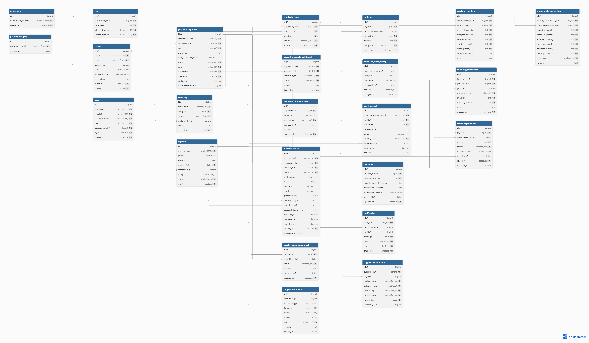

# Enterprise Procurement System

A web-based enterprise procurement management system designed to manage the complete procurement lifecycle, from purchase requisition creation and approval through supplier selection, purchase order generation, goods receipt, inventory updates, supplier performance evaluation, and return/replacement handling.

The current backend domain model contains **24 core database entities** and supports role-based users, departmental budgeting, products and suppliers, requisitions, approvals, purchase orders, inventory, notifications, compliance, audit logging, and supplier management.

---

## Table of Contents

- [Project Overview](#project-overview)
- [Objectives](#objectives)
- [Key Features](#key-features)
- [Procurement Workflow](#procurement-workflow)
- [User Roles](#user-roles)
- [Functional Modules](#functional-modules)
- [Database Design](#database-design)
- [Core Tables](#core-tables)
- [Entity Relationships](#entity-relationships)
- [Technology and Architecture](#technology-and-architecture)
- [Security](#security)
- [Notifications and Audit](#notifications-and-audit)
- [Inventory and Goods Receipt](#inventory-and-goods-receipt)
- [Supplier Management](#supplier-management)
- [Return and Replacement](#return-and-replacement)
- [Project Structure](#project-structure)
- [Configuration](#configuration)
- [Running the Project](#running-the-project)
- [API Overview](#api-overview)
- [Database Diagram](#database-diagram)
- [Workflow Diagram](#workflow-diagram)
- [Validation and Business Rules](#validation-and-business-rules)
- [Future Enhancements](#future-enhancements)
- [Author](#author)

---

## Project Overview

The Enterprise Procurement System centralizes procurement activities into one application. Instead of handling requisitions, approvals, supplier information, purchase orders, receiving, inventory, and supplier evaluation separately, the system connects these activities into a traceable workflow.

The main business flow is:

**Purchase Requisition → Authorization/Validation → Approval → Budget Check → Higher Authority Approval (when required) → Supplier Selection → Supplier Compliance Check → Purchase Order → Goods Receipt → Quality Inspection → Inventory Update**

Additional flows handle:

- Requisition status history
- Purchase order status history
- Notifications
- Supplier documents and compliance
- Supplier performance ratings
- Returns and replacements
- Audit logging
- Budget utilization

---

## Objectives

The system is intended to:

1. Digitize the procurement process.
2. Reduce manual procurement work and paperwork.
3. Provide a controlled approval workflow.
4. Improve supplier evaluation and compliance tracking.
5. Maintain visibility of purchase orders and deliveries.
6. Keep inventory quantities synchronized with received goods.
7. Record procurement activities for auditing and traceability.
8. Provide a single source of truth for procurement-related information.

---

## Key Features

### Purchase Requisition Management

- Create purchase requisitions.
- Generate a unique requisition number.
- Add multiple requisition items.
- Store product, quantity, unit price, and estimated total.
- Track requisition status.
- Assign priority.
- Detect or mark duplicate requisitions.
- Maintain status history.

### Approval Management

- Assign approvers to requisitions.
- Support approval types and approval statuses.
- Store approval remarks.
- Record decision timestamps.
- Maintain the latest approval reference for a requisition.

### Budget Management

- Maintain budgets by department and fiscal year.
- Store allocated and utilized amounts.
- Prevent duplicate department/fiscal-year budget records through a unique constraint.
- Support budget availability checks as part of the procurement workflow.

### Supplier Management

- Manage supplier companies.
- Associate a supplier with a system user.
- Categorize suppliers.
- Track supplier verification status.
- Store supplier rating and activation status.
- Maintain supplier documents.
- Maintain supplier compliance checks.
- Record supplier performance against purchase orders.

### Purchase Order Management

- Generate purchase orders from approved procurement activities.
- Associate purchase orders with requisitions and suppliers.
- Store total amount and status.
- Store PO, invoice, and goods-receipt related document URLs.
- Track who generated, completed, or cancelled a PO.
- Track expected delivery and actual delivery timestamps.
- Track replacement counts.
- Maintain purchase order status history.

### Goods Receipt and Quality Inspection

- Create goods receipts against purchase orders.
- Record received date and receipt number.
- Track delays.
- Record inspection status.
- Assign the user responsible for inspection.
- Record inspection remarks.
- Maintain detailed item-level quantities such as received, accepted, rejected, shortage, and extra quantity.

### Inventory Management

- Maintain inventory for products.
- Track quantity on hand.
- Track quantity under inspection.
- Track quarantined quantity.
- Maintain warehouse location.
- Record the last purchase order associated with inventory.
- Maintain inventory transactions with transaction type, quantity, and balance quantity.

### Return and Replacement Management

- Raise return/replacement requests against purchase orders.
- Link returns to goods receipts.
- Store reason, status, and resolution type.
- Track who raised the return.
- Track resolution timestamps.
- Record item-level defective, shortage, and extra quantities.
- Record the issue type and remarks.

### Notification Management

- Create user notifications.
- Link notifications to requisitions or purchase orders when applicable.
- Support notification types.
- Track read/unread status.
- Maintain notification creation time.

### Audit Logging

- Record the entity involved in an operation.
- Store the entity identifier.
- Record the action performed.
- Record the user who performed the action.
- Store additional operation details.
- Record the timestamp.

---

## Procurement Workflow

The provided workflow diagram describes a multi-stage procurement process with separate responsibilities across participants. The flow starts with a requester creating and submitting a purchase requisition and continues through system validation, authorization, approval, budgeting, supplier processing, purchase order generation, receiving, inspection, inventory update, and return handling.

### Stage 1: Create Requisition

The requester starts the process by creating a purchase requisition.

The requester then:

- Enters requisition information.
- Validates form data.
- Checks whether data is valid.
- Edits the requisition when necessary.
- Submits the requisition.

### Stage 2: System Validation

The system processes the submitted requisition.

The workflow includes:

- User authorization check.
- Requisition validation.
- Duplicate detection.
- Error/correction handling when validation fails.
- Approval or correction path based on the validation result.

### Stage 3: Requisition Review and Approval

The requisition is routed for review.

The workflow checks whether the requisition is approved. When it is not approved, a notification is sent and the process can end at that stage.

### Stage 4: Budget Availability

When the requisition is approved, the budget availability is checked.

The workflow supports:

- Budget availability checking.
- A finance-related decision path.
- Notification when budget is not available.
- Escalation to higher authority when required.

### Stage 5: Supplier Selection and Compliance

The procurement process then moves to supplier handling.

The workflow includes:

- Select supplier.
- Supplier compliance check.
- Determine whether the supplier is compliant.
- Choose an alternative supplier when the compliance check fails.
- Continue procurement when a valid supplier is available.
- End the procurement path when an alternative supplier cannot be found.

### Stage 6: Purchase Order Generation

After the supplier decision, a purchase order is generated.

The workflow also contains notification steps associated with procurement actions and supplier processing.

### Stage 7: Supplier Delivery

The supplier receives the purchase order and proceeds with delivery.

The supplier-side flow includes checks such as:

- PO received or not received.
- Delivery execution.
- Delay/escalation handling.
- Delivery completion.

### Stage 8: Goods Receipt and Inspection

The receiving process records delivered goods.

The system then:

- Accepts goods for inspection.
- Inspects received quantities and quality.
- Compares received quantities with expected quantities.
- Identifies shortages, excess quantities, or rejected/defective items.

### Stage 9: Inventory Update

After receipt processing, accepted inventory is updated.

Inventory transactions are recorded to keep a history of quantity changes.

### Stage 10: Return/Replacement

When a quality or quantity issue is identified, a return or replacement process can be raised.

The workflow supports return/replacement processing after delivery and inspection.

---

## User Roles

The uploaded domain model defines a `User` entity with a role field and Spring Security authority mapping.

### User

Users contain:

- Full name
- Email
- Password hash
- Role
- Department
- Active/inactive state
- Creation timestamp

The role is converted into a Spring Security authority using the `ROLE_` prefix.

### Supplier User

A supplier can be represented through the supplier entity and its one-to-one association with a user account.

Supplier-related responsibilities include:

- Supplier information management
- Document submission
- Compliance information
- Purchase order processing
- Delivery-related activities
- Performance tracking

### Internal Procurement Users

Internal users participate in requisition, approval, finance, procurement, receiving, inspection, and audit activities depending on their assigned responsibilities.

---

## Functional Modules

### 1. Authentication and Authorization

- User identity management
- Login and authentication
- Role-based access control
- Active/inactive user state
- Spring Security integration

### 2. Department and Budget

- Department master data
- Department-level budget
- Fiscal-year budget allocation
- Budget utilization

### 3. Product Catalog

- Product categories
- Product master
- SKU
- Unit
- Standard price
- Product activation status

### 4. Supplier Management

- Supplier registration
- Supplier verification
- Supplier category
- Supplier documents
- Supplier compliance
- Supplier performance

### 5. Requisition Management

- Requisition creation
- Requisition items
- Priority
- Status
- Approval
- History

### 6. Purchase Order

- PO generation
- PO items
- PO status
- PO history
- Delivery dates
- Attachments and document URLs

### 7. Goods Receipt

- Receipt creation
- Receipt items
- Quantity reconciliation
- Quality inspection
- Inspection user and timestamp

### 8. Inventory

- Current stock
- Inspection quantity
- Quarantine quantity
- Inventory location
- Transaction history

### 9. Return/Replacement

- Return/replacement request
- Return items
- Issue categorization
- Resolution tracking

### 10. Notification and Audit

- In-app notifications
- Procurement activity history
- Audit log

---

## Database Design

The database design currently contains **24 entities** represented in the supplied ER diagram.

The ER diagram includes the following areas:

- Organizational data
- Budgeting
- Product catalog
- Supplier management
- Requisition and approval
- Purchase orders
- Goods receipt
- Inventory
- Returns/replacements
- Notifications
- Audit

The ER diagram was generated from the project entity model and includes primary keys, foreign-key fields, and the relationships between the entities.

---

## Core Tables

| # | Table | Purpose |
|---|---|---|
| 1 | `department` | Stores departments |
| 2 | `budget` | Department-wise fiscal-year budgets |
| 3 | `product_category` | Product and supplier categories |
| 4 | `product` | Product catalog |
| 5 | `supplier` | Supplier master data |
| 6 | `purchase_requisition` | Purchase request header |
| 7 | `requisition_item` | Items requested in a requisition |
| 8 | `approvPurchaseRequisitional` | Requisition approval records |
| 9 | `requisition_status_history` | Requisition status changes |
| 10 | `purchase_order` | Purchase order header |
| 11 | `po_item` | Purchase order line items |
| 12 | `purchase_order_history` | Purchase order status history |
| 13 | `goods_receipt` | Goods receipt header |
| 14 | `goods_receipt_item` | Goods receipt line items |
| 15 | `inventory` | Current product inventory |
| 16 | `inventory_transaction` | Inventory movement history |
| 17 | `return_replacement` | Return/replacement header |
| 18 | `return_replacement_item` | Return/replacement line items |
| 19 | `notification` | User notifications |
| 20 | `audit_log` | Audit trail |
| 21 | `user` | User accounts and roles |
| 22 | `supplier_compliance_check` | Supplier compliance reviews |
| 23 | `supplier_document` | Supplier uploaded documents |
| 24 | `supplier_performance` | Supplier performance ratings |

---

## Entity Relationships

Important relationships in the current model include:

- `Department` → many `Budget` records
- `Department` → many `User` records
- `ProductCategory` → many `Product` records
- `ProductCategory` → many `Supplier` records
- `User` → one `Supplier` account association
- `User` → many requisitions through the employee/requester relationship
- `PurchaseRequisition` → many `RequisitionItem` records
- `Product` → many `RequisitionItem` records
- `PurchaseRequisition` → many `Approval` records
- `PurchaseRequisition` → many status-history records
- `PurchaseRequisition` → many `PurchaseOrder` records according to the current entity relationship
- `Supplier` → many `PurchaseOrder` records
- `PurchaseOrder` → many `PoItem` records
- `PurchaseOrder` → many `GoodsReceipt` records
- `GoodsReceipt` → many `GoodsReceiptItem` records
- `Product` → one `Inventory` record
- `Inventory` → many `InventoryTransaction` records
- `PurchaseOrder` → many `ReturnReplacement` records
- `ReturnReplacement` → many `ReturnReplacementItem` records
- `GoodsReceiptItem` → many `ReturnReplacementItem` records
- `Supplier` → many compliance checks
- `Supplier` → many supplier documents
- `Supplier` → many performance records
- `PurchaseOrder` → many supplier performance records
- `User` participates in approval, history, inspection, notification, audit, compliance, and performance-related relationships

---

## Technology and Architecture

The uploaded entity source shows a Java backend based on the Spring ecosystem.

### Backend

- Java
- Spring Boot
- Spring Data JPA
- Hibernate/JPA
- Spring Security
- Lombok
- Jakarta Persistence API

### Persistence

The domain model uses relational database entities with:

- Primary keys
- Foreign keys
- Unique constraints
- One-to-one relationships
- Many-to-one relationships
- One-to-many relationships
- Enumerated status fields
- Timestamps
- Large text fields where required

### Security

The `User` entity implements `UserDetails`, and user roles are converted to Spring Security authorities using the `ROLE_<ROLE>` format.

### Frontend

The exact frontend framework and version are not present in the supplied entity/diagram files. Add the frontend technology and version here when documenting the final repository configuration.

---

## Security

Security is integrated through Spring Security at the user-domain level.

The current user model contains:

- Unique email
- Password hash
- Role
- Department
- Active status

Authorization can be implemented using the role stored in the `User` entity and the Spring Security authority generated by the entity.

Recommended security practices for deployment:

- Store passwords only as secure hashes.
- Keep secrets and database credentials outside source control.
- Validate and authorize every protected API.
- Restrict supplier and internal procurement operations according to role.
- Record sensitive business actions in the audit log.

---

## Notifications and Audit

### Notifications

The `notification` entity stores:

- User
- Optional requisition
- Optional purchase order
- Message
- Notification type
- Read/unread state
- Creation timestamp

This supports contextual notifications around procurement activities.

### Audit Log

The `audit_log` entity records:

- Entity type
- Entity ID
- Action
- User who performed the action
- Additional details
- Creation timestamp

This provides traceability for important procurement actions.

---

## Inventory and Goods Receipt

Goods receipt processing is directly connected to inventory and procurement.

A goods receipt is associated with a purchase order and contains item-level receipt records. Each item records multiple quantity states:

- Ordered quantity
- Received quantity
- Accepted quantity
- Rejected quantity
- Shortage quantity
- Extra quantity

The inventory model separately tracks:

- Quantity on hand
- Quantity under inspection
- Quantity quarantined
- Warehouse location

Inventory transactions maintain the movement history and resulting balance quantity.

---

## Supplier Management

Supplier management is more than a basic supplier master.

Each supplier can have:

### Supplier Documents

- Document type
- File name
- File URL
- Upload timestamp
- Verification status
- Remarks
- Verification timestamp

### Supplier Compliance

- Supplier
- Related requisition when applicable
- Compliance status
- Remarks
- Checker
- Check timestamp

### Supplier Performance

The system stores:

- Quality rating
- Delivery rating
- Price rating
- Overall rating
- Review date
- Reviewer
- Related purchase order when applicable

This allows supplier quality and procurement performance to be evaluated over time.

---

## Return and Replacement

The return/replacement module handles issues discovered after procurement and receiving.

At the header level, the system stores:

- Purchase order
- Goods receipt
- Reason
- Return status
- Resolution type
- Raised by
- Raised timestamp
- Resolution timestamp

At the item level, it stores:

- Expected quantity
- Received quantity
- Accepted quantity
- Defective quantity
- Shortage quantity
- Extra quantity
- Issue type
- Remarks

This allows the organization to trace the issue back to the original purchase and receipt records.

---

## Project Structure

A recommended repository structure is:

```text
enterprise-procurement-system/
├── backend/
│   ├── src/
│   │   ├── main/
│   │   │   ├── java/
│   │   │   │   └── com/eps/enterprise_procurement_system/
│   │   │   │       ├── controllers/
│   │   │   │       ├── services/
│   │   │   │       ├── repositories/
│   │   │   │       ├── entities/
│   │   │   │       ├── dto/
│   │   │   │       ├── security/
│   │   │   │       ├── exceptions/
│   │   │   │       └── config/
│   │   │   └── resources/
│   │   └── test/
│   └── pom.xml
├── frontend/
├── docs/
│   ├── db_er_diagram.pdf
│   └── workflow.png
└── README.md
```

Adjust folder names to match the actual repository structure.

---

## Configuration

The application should externalize environment-specific configuration.

Typical configuration includes:

```properties
spring.datasource.url=YOUR_DATABASE_URL
spring.datasource.username=YOUR_DATABASE_USERNAME
spring.datasource.password=YOUR_DATABASE_PASSWORD

spring.jpa.hibernate.ddl-auto=update
spring.jpa.show-sql=false

server.port=8080
```

If JWT, email, file storage, or other services are enabled in the project, keep their secrets in environment variables or a secure configuration mechanism rather than committing them to Git.

---

## Running the Project

### Prerequisites

Install the software required by the actual project configuration, typically:

- Java JDK
- Maven
- Relational database
- Git
- Node.js/npm if a JavaScript frontend is included

### Clone the Repository

```bash
git clone <repository-url>
cd enterprise-procurement-system
```

### Backend

Go to the backend directory:

```bash
cd backend
```

Build the project:

```bash
mvn clean install
```

Run the Spring Boot application:

```bash
mvn spring-boot:run
```

Or run the generated JAR:

```bash
java -jar target/<application-name>.jar
```

### Frontend

When a frontend is included and uses Node.js:

```bash
cd frontend
npm install
npm run dev
```

Use the actual frontend commands defined by the repository's `package.json`.

---

## API Overview

The exact controller and endpoint list should be maintained from the implemented backend. Typical resource groups for this domain are:

| Resource | Purpose |
|---|---|
| Authentication | Login, authentication and user access |
| Users | User management and role information |
| Departments | Department master data |
| Budgets | Fiscal-year department budgets |
| Products | Product catalog |
| Categories | Product/supplier categories |
| Suppliers | Supplier management |
| Supplier Documents | Supplier document management |
| Supplier Compliance | Compliance checks |
| Supplier Performance | Supplier ratings and reviews |
| Requisitions | Purchase requisition lifecycle |
| Requisition Items | Requested products and quantities |
| Approvals | Requisition approval processing |
| Purchase Orders | Purchase order lifecycle |
| PO Items | Purchase order line items |
| Goods Receipts | Receiving and inspection |
| Inventory | Current stock |
| Inventory Transactions | Inventory movement history |
| Returns/Replacements | Defective or quantity issue processing |
| Notifications | User notifications |
| Audit Logs | Traceability and auditing |

Document the exact HTTP method, URL, request body, and response body for each implemented controller before publishing the final repository documentation.

---

## Database Diagram

The supplied ER diagram represents the 24-table relational model of the application.

The main database areas visible in the diagram are:

- `department`, `budget`, `user`
- `product_category`, `product`
- `supplier`, `supplier_document`, `supplier_compliance_check`, `supplier_performance`
- `purchase_requisition`, `requisition_item`, `approvPurchaseRequisitional`, `requisition_status_history`
- `purchase_order`, `po_item`, `purchase_order_history`
- `goods_receipt`, `goods_receipt_item`
- `inventory`, `inventory_transaction`
- `return_replacement`, `return_replacement_item`
- `notification`, `audit_log`

 

 

 

 

---

## Workflow Diagram

The supplied workflow diagram shows the end-to-end business process across requester, system, approval/management, finance, administration/procurement, and supplier activities.
 

 

The workflow covers requisition creation, validation, duplicate checking, authorization, approval, budget verification, supplier selection and compliance, PO generation, supplier delivery, receiving and inspection, inventory update, and return/replacement handling.

---

## Validation and Business Rules

The entity model currently enforces a number of database-level rules, including:

- Department name is unique.
- Budget is unique per department and fiscal year.
- Product SKU is unique.
- Product category name is unique.
- Supplier can be linked to one user account through a unique user relationship.
- Requisition number is unique.
- Purchase order number is unique.
- Goods receipt number is unique.
- Inventory has a unique product association.
- Required workflow fields are marked as non-null where applicable.
- Several status fields are stored as enumerated strings.
- Creation/update timestamps are automatically populated in entity lifecycle callbacks where defined.

Business-level validation such as authorization rules, budget rules, duplicate checks, supplier compliance logic, and workflow transitions should remain enforced in the service/business layer in addition to database constraints.

---

## Future Enhancements

Possible extensions for the system include:

- Advanced procurement analytics dashboard
- Spend analysis by department and supplier
- Supplier scorecards and trend charts
- Automated approval escalation
- Automated email/SMS notifications
- Digital approval signatures
- Purchase order PDF generation
- Invoice matching and three-way matching
- Warehouse-level inventory management
- Low-stock alerts
- Barcode/QR-based receiving
- Supplier self-service portal
- Advanced search and reporting
- Excel/PDF exports
- Scheduled compliance reminders
- Integration with accounting/ERP systems
- Centralized document storage

---

## Documentation Assets

The project documentation should include the following supporting artifacts:

```text
docs/
├── db_er_diagram.pdf
├── db_er_diagram.png
└── workflow.png
```

The ER diagram is based on the project's relational entity model, while the workflow diagram represents the operational procurement process.

---

## Author

**Enterprise Procurement System Project**

Add the team/member names, institution, guide/mentor, and project year here before final submission.

---

## License

Add the project's applicable license here, if required.
